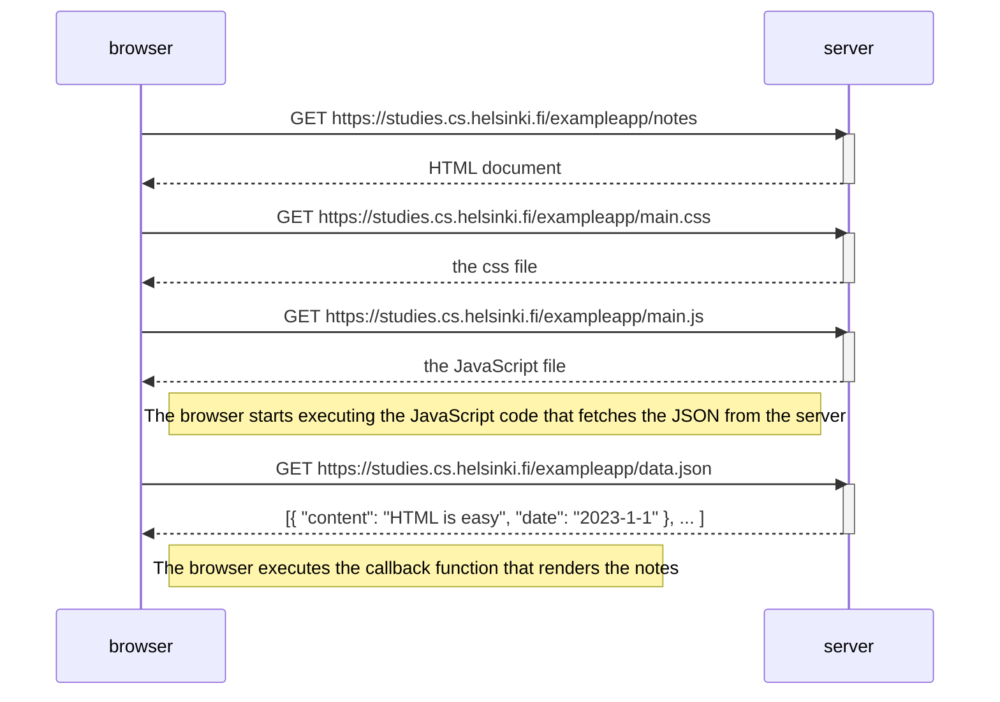

# fundamentals of web apps

- [example]
- The 1st rule of web development: Always keep the Developer Console open on your web browser.

## HTTP GET

## traditional web applications

## running application logic in the browser

## event handlers and callback functions

>The mechanism of invoking event handlers is very common in JavaScript. Event handler functions are called [callback] functions. The application code does not invoke the functions itself, but the runtime environment - the browser, invokes the function at an appropriate time when the event has occurred.

...

## JavaScript fatigue

## [exercises 0.1 - 0.6](https://fullstackopen.com/en/part0/fundamentals_of_web_apps#exercises-0-1-0-6)

### [0.1: HTML](./exercises/01html/README.md)

>Review the basics of HTML by reading this tutorial from Mozilla: [HTML tutorial].

### [0.1: CSS](./exercises/01css/README.md)

>Review the basics of CSS by reading this tutorial from Mozilla: [CSS tutorial].

### [0.3: HTML forms](./exercises/03html_forms/README.md)

>Learn about the basics of HTML forms by reading Mozilla's tutorial [Your first form].

### [0.4: New note diagram](./exercises/04note_diagram/README.md)

The following [sequence diagram] was made using [mermaid]

[example]: https://studies.cs.helsinki.fi/exampleapp
[HTTP]: https://developer.mozilla.org/en-US/docs/Web/HTTP
[GET]: https://developer.mozilla.org/en-US/docs/Web/HTTP/Methods/GET
[status code]: https://en.wikipedia.org/wiki/List_of_HTTP_status_codes
[callback]: https://developer.mozilla.org/en-US/docs/Glossary/Callback_function
[HTML tutorial]: https://developer.mozilla.org/en-US/docs/Learn/Getting_started_with_the_web/HTML_basics
[CSS tutorial]: https://developer.mozilla.org/en-US/docs/Learn/Getting_started_with_the_web/CSS_basics
[Your first form]: https://developer.mozilla.org/en-US/docs/Learn/Forms/Your_first_form
[sequence diagram]: https://www.geeksforgeeks.org/unified-modeling-language-uml-sequence-diagrams
[mermaid]: https://github.com/mermaid-js/mermaid#sequence-diagram-docs---live-editor