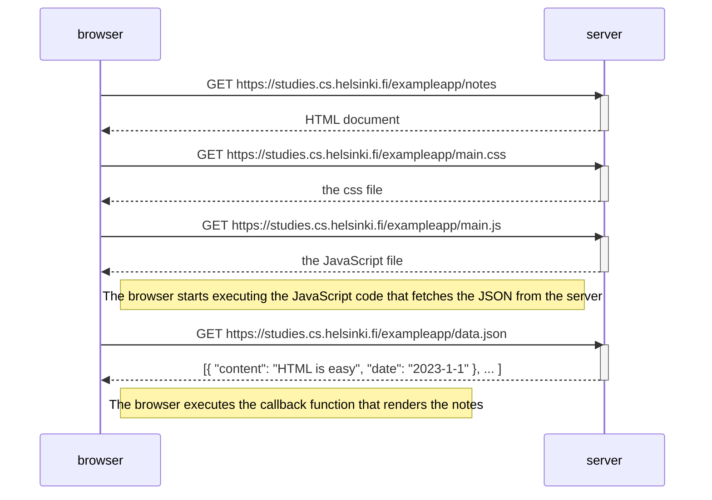
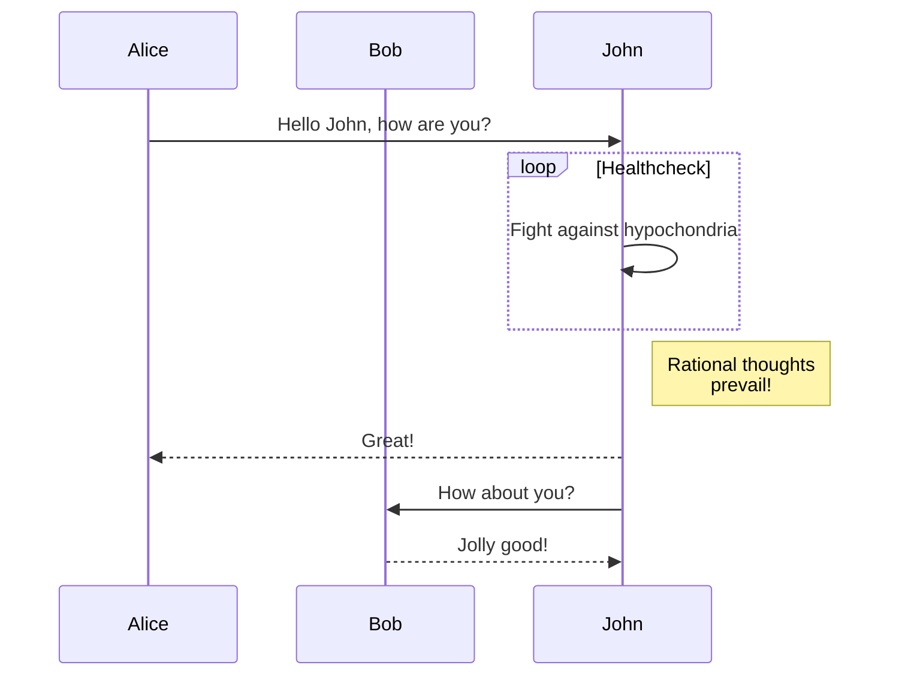
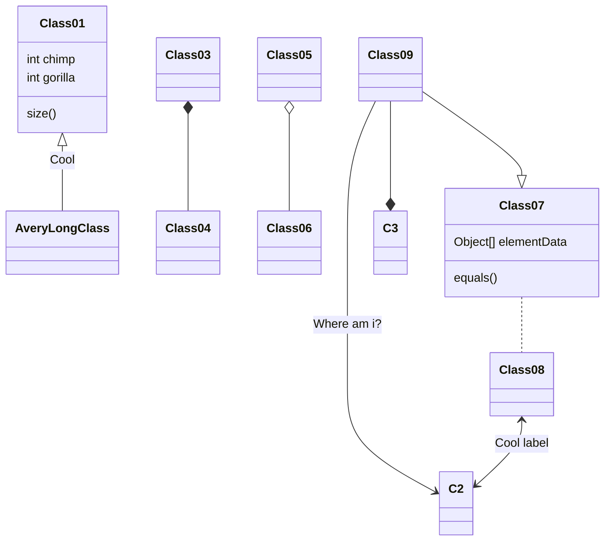

# Fundamentals of Web apps

## [HTTP] [GET]
- [example application](https://studies.cs.helsinki.fi/exampleapp)

>The 1st rule of web development: Always keep the Developer Console open on your web browser. 

- General
- Headers
  - Response
    - size in bytes
    - exact time
    - [content type] is a text file in [utf-8] format contents in [HTML]
  - Request
- Response tab has a regular [HTML] page

>Because of the img tag, the browser does a second HTTP request to fetch the image  from the server. 

## traditional web applications

## running application logic in the browser

## event handlers and callback functions

>Event handler functions are called [callback] functions. The application code does not invoke the functions itself, but the runtime environment - the browser, invokes the function at an appropriate time when the event has occurred.

## Document Object Model or [DOM]

>Document Object Model, or [DOM], is an Application Programming Interface (API) that enables programmatic modification of the element trees corresponding to web pages.

## manipulating the document object from the console

## CSS

## loading a page containing JavaScript - review

## Forms and HTTP POST
## AJAX
## Single page app
## JavaScript-libraries
## Full-stack web development

>Practically all web applications have (at least) two "layers": the browser, being closer to the end-user, is the top layer, and the server the bottom one. There is often also a database layer below the server. We can therefore think of the architecture of a web application as a stack of layers.

## JavaScript fatigue

## exercises 0.1 - 0.6

Here is a simple flow chart:

[HTTP]: https://developer.mozilla.org/en-US/docs/Web/HTTP

[GET]: https://developer.mozilla.org/en-US/docs/Web/HTTP/Methods/GET

[status codes]: https://en.wikipedia.org/wiki/List_of_HTTP_status_codes

[content type]: https://developer.mozilla.org/en-US/docs/Web/HTTP/Headers/Content-Type

[utf-8]: https://en.wikipedia.org/wiki/UTF-8

[HTML]: https://en.wikipedia.org/wiki/HTML

[sequence diagram]: https://www.geeksforgeeks.org/unified-modeling-language-uml-sequence-diagrams/#

[sequence diagram wikipedia]: https://en.wikipedia.org/wiki/Sequence_diagram

[readyState]: https://developer.mozilla.org/en-US/docs/Web/API/XMLHttpRequest/readyState

[callback]: https://developer.mozilla.org/en-US/docs/Glossary/Callback_function

[DOM]: https://en.wikipedia.org/wiki/Document_Object_Model

[frontend and backend]: https://en.wikipedia.org/wiki/Frontend_and_backend